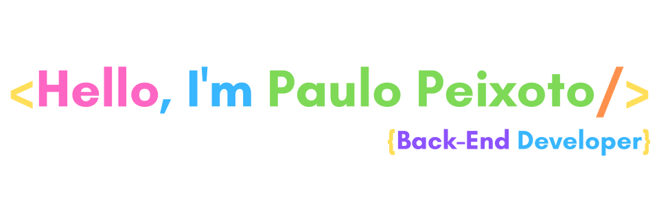

=============

 

  <a href="https://github.com/padupe">
  
  

   
 
      
      
      
      
      
      
       
      

   
   ##
   
   
 
  
  
 	
  

   ##
   
> Possuo Bacharelado em Administração ([UNIP](https://unip.br/ "UNIP")) e Pós Graduação em Ensino Superior ([UNITAU](https://www.unitau.br/ "UNITAU"))

> Liderei o projeto de implantação de Sistema de Gestão do Transporte Público Escolar da Secretaria de Educação e Cidadania de São José dos Campos/SP entre os anos 2017 e 2018

# 💡 Competências Chaves

* Node.js
* JavaScript
* TypeScript
* [Backstage](https://backstage.io/)
  * _Developer Experience_
* Express
* Linux
  * Ubuntu
* Testes Unitários e de Integração
* Docker
* SQLite
* MySQL
* PostgreSQL
* Git

# ⚙ Experiências

* API Rest
* Autenticação com JWT
* Conventional Commits
* CSS
* GitFlow
* GraphQL
* HTML
* Logging
* Metodologias Ágeis
    * Kanban
    * SCRUM
* Prisma ORM
* Python
* Swagger
* TypeORM

# 💎 Soft Skils

* Criatividade
* Empatia
* Facilidade em construir e expor ideias
* Flexibilidade
* Pensamento Crítico
* Relacionamento Interpessoal
* Trabalho em Equipe

# 📚️ Estou Estudando

* NestJS (Framework)
* SOLID

 
# Experiência Profissional

## [Visual Mode](https://visualmode.com.br/ "Visual Mode")

### Nível
Estagiário

### Objetivo
Desenvolvimento de aplicações Web utilizando React.
 
### Tecnologias/Ferramentas Utilizadas
- CSS
- Express
- GitHub (Versionamento)
- HTML
- Javascript
- MySQL
- Node.js
- React

### Metodologias adotada
- SCRUM

| *Início*  |  *Término* |
|:-:|:-:|
|  Dez/2020 |  Abr/2021 |

##

## [Infranology](https://infranology.com.br/ "Infranology")

### Nível
Estagiário

### Objetivo
Desenvolvimento de Aplicação para e-commerce baseada em Nodejs, utilizando Express, ORM Prisma, PostgreSQL, Docker, Testes Unitários e de Integração e diversas bibliotecas complementares.
 
 
### Tecnologias/Ferramentas Utilizadas
- Autenticação JWT
- Docker
- Estrutura MVC
- Express
- GitLab (Versionamento)
- Javascript
- Jest
- Kanban
- Logging
- Node.js
- Prisma ORM
- Super Test
- SQLite
- PostgreSQL

### Metodologias adotada
- Kanban
 
| *Início*  |  *Término* |
|:-:|:-:|
|  Abr/2021 |  Ago/2021 |

##

## [MadeiraMadeira](https://www.madeiramadeira.com.br/ "MadeiraMadeira")

### Nível
Júnior -> Pleno

### Integrando o time de SRE - _Site Reliability Enginnering_
> Agosto/2021 - Junho/2022
 
 #### Monitoria de Aplicações e Serviços
- AWS;
- Grafana;
- New Relic.

### Integrando o time de DX - _Developer Experience_
> Julho/2022 - 14/Outubro/2022

#### Portal do Desenvolvedor (baseado no [Backstage](https://backstage.io/) do Spotify)
- Arquiteturas de Referência;
- Documentações;
- Ferramentas Utilizadas;
- Integração com o GitHub;
  - Usuários;
  - Squads;
  - Projetos.
- Onboarding Tech;
- Radar Tecnológico (Tecnologias e Soluções utilizadas);

#### Tecnologias/Ferramentas Utilizadas
- API Gateway (Kong)
- AWS
- Confluence
- Docker
- GitHub (Actions, App's e Versionamento)
- Grafana
- Javascript
- Jira
- MySQL
- New Relic
- Node.js
- NoSQL
- PostgreSQL
- Python
- React
- Terraform
- Typescript

### Metodologias adotadas
- Kanban
- SCRUM

| *Início*  |  *Término* |
|:-:|:-:|
|  Ago/2021 |  Out/2022 |

##

## [Raízen](https://raizen.com/ "Raízen")

### Nível
Pleno

### Objetivo
- Implementação do [Backstage](https://backstage.io/) na organização;
  - Catálogo de Software;
  - Documentações Técnicas;
  - Templates.
  - Integrações
    - AWS;
    - Azure;
    - GitHub.

#### Tecnologias/Ferramentas Utilizadas
- Azure
- AWS
- Confluence
- Docker
- GitHub (Actions, App's e Versionamento)
- Javascript
- Node.js
- PostgreSQL
- React
- Typescript

### Metodologias adotadas
- Kanban
- SCRUM

| *Início*  |  *Término* |
|:-:|:-:|
|  Out/2022 |  Atual |
